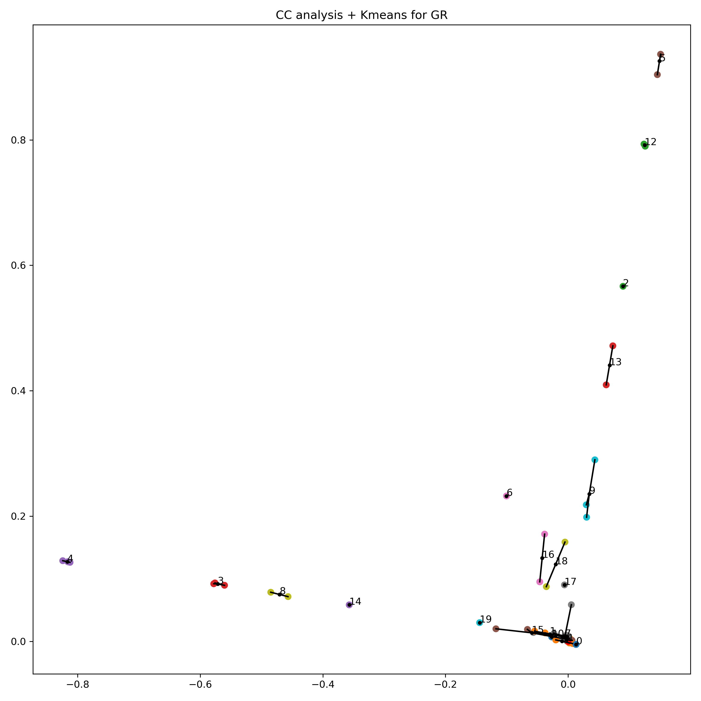
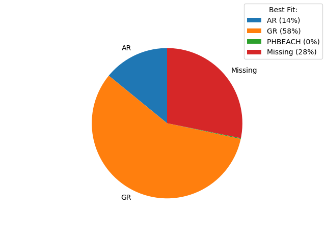
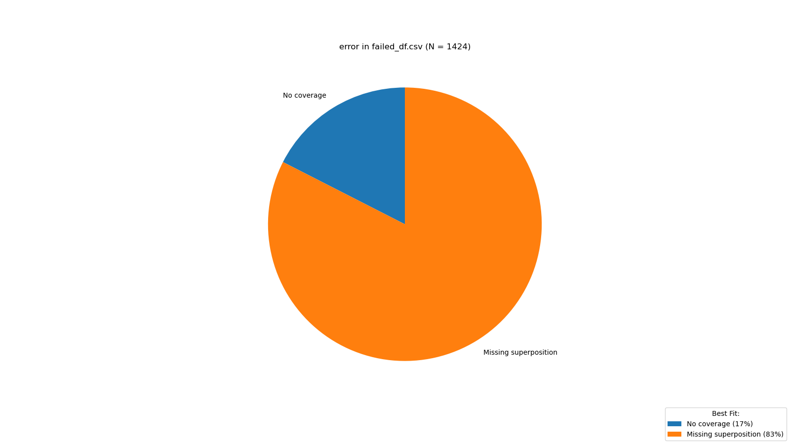

# projectB
**Iain Visa** @ IBMB-CSIC
## Instructions:

- Install dependencies from `requirements`

- Run `main.py`
- Run `surface.py`
- Run `clustering.py`

## Current clustering for GR

## Current Data distribution:

