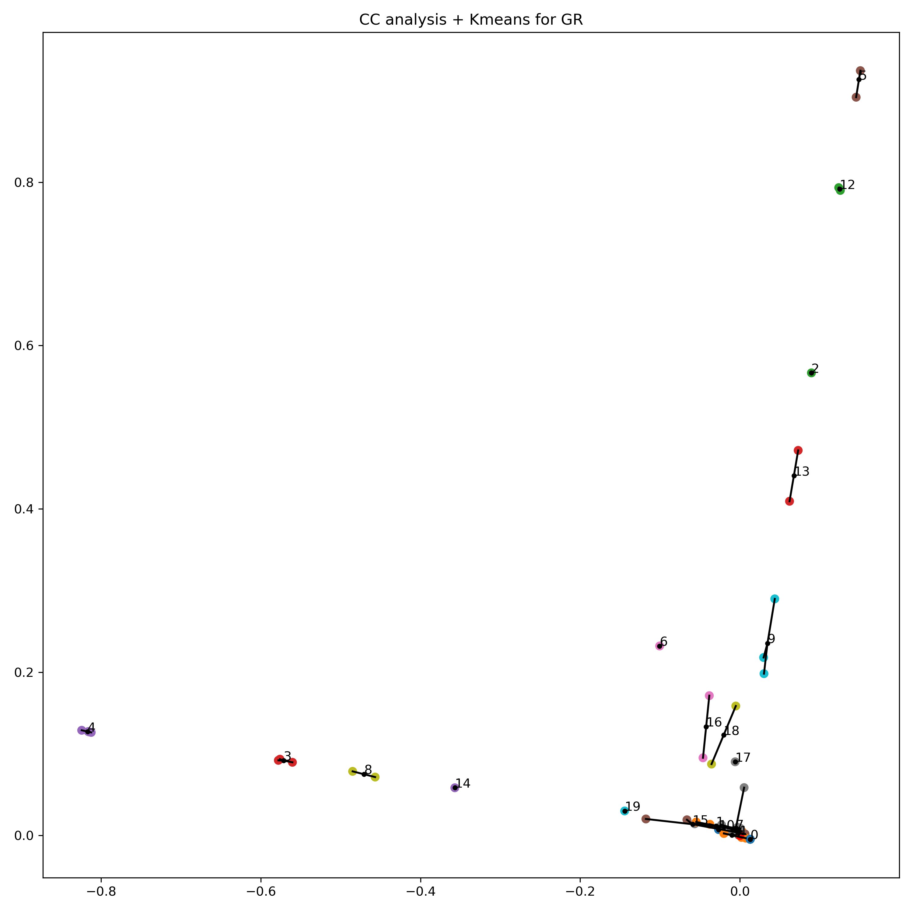
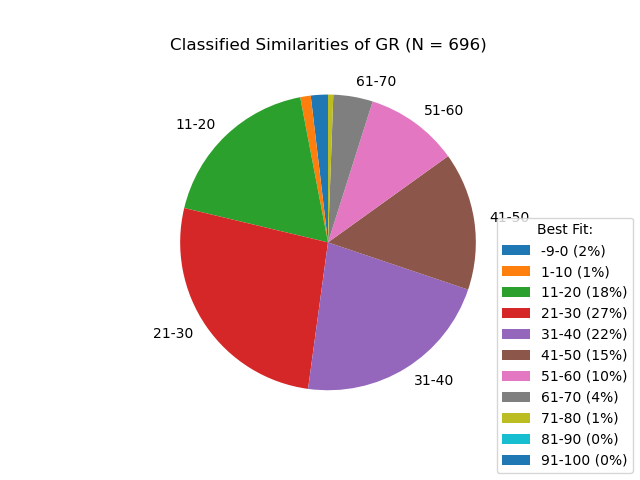
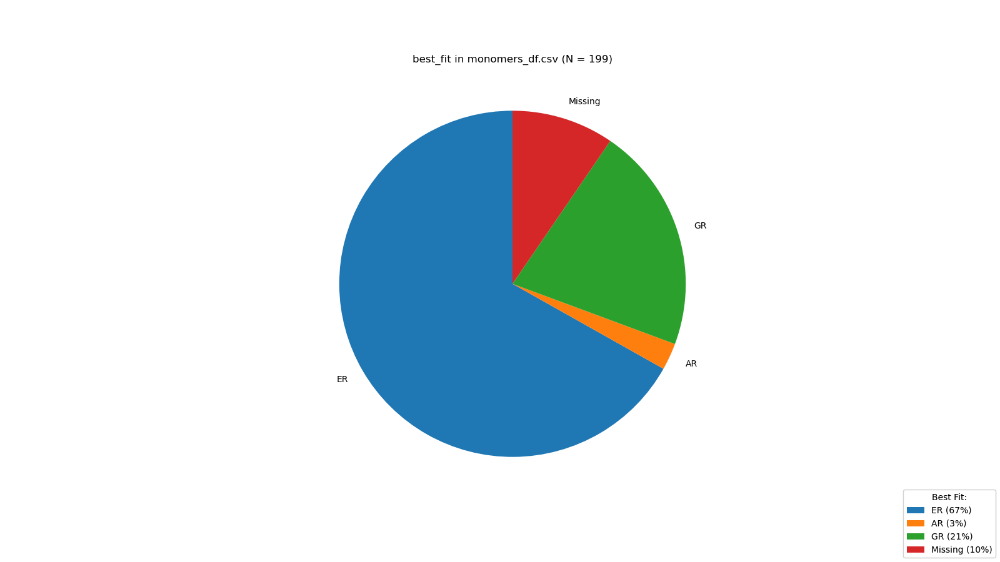
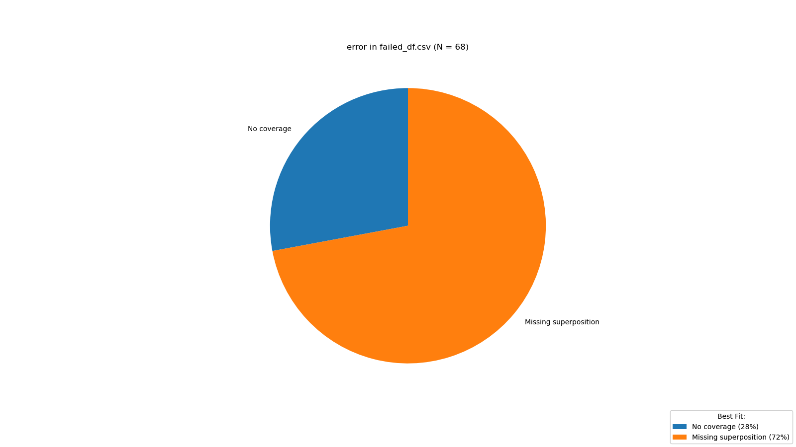

# ProjectDimer
A tool for protein-protein interaction classification.
<br>
<br>


**Iain Visa** @ Universitat de Barcelona / IBMB-CSIC
<br>
<br>
<br>

## Installation: 
In a Linux `bash` terminal (Windows not fully tested): 
- Clone this repository wherever you like.
- Download and install [conda](https://www.anaconda.com).
- Follow instructions in `environment.txt` to setup the environment.
- Source `bashrc.project` by adding the following snippet at the end of your `.bashrc` file:
  ```
  
  FOLDER_PATH = "/path/to/.../projectDimer"
  projectDimer(){
      if [ -f $FOLDER_PATH/bashrc.project ]; then
          source $FOLDER_PATH/bashrc.project
      
      fi
  }
  ```
- Restart the shell (`bash` or `exec bash`).
- Type `projectDimer`.
- `run` and `show` commands should now be available.


## To see data/results 
- Run `visualisation.py` with the following commands:
  * `dimer`/s + the dimer id, e.g. `1M2Z_AB'
  * `clusters-eva` to see clusters from Eva's classification
  * `clusters-cc` to see clusters from CC analysis + KMeans
  * `clusters-score`/s to see how (GR only) clusters compare between methods


## Current clustering for GR


## Current Data distribution:




